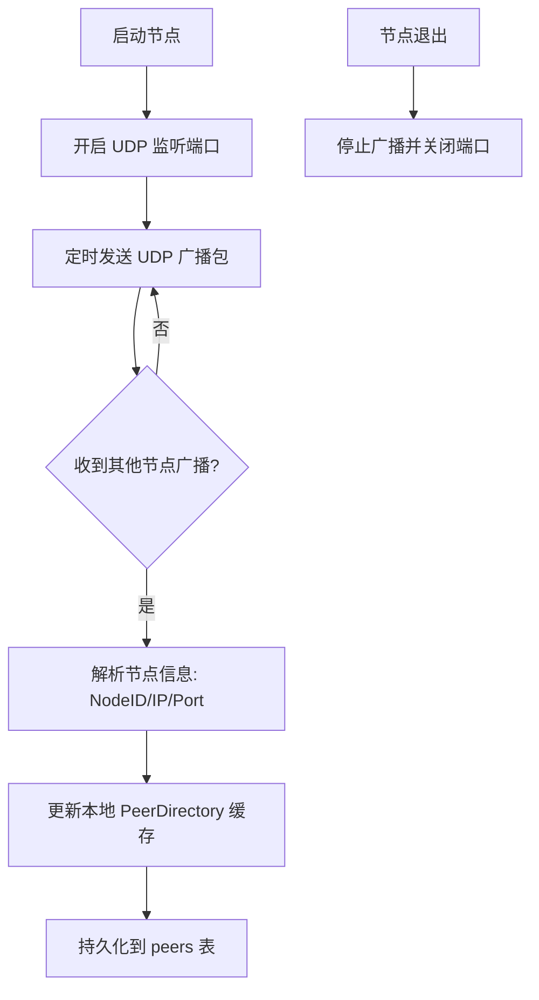
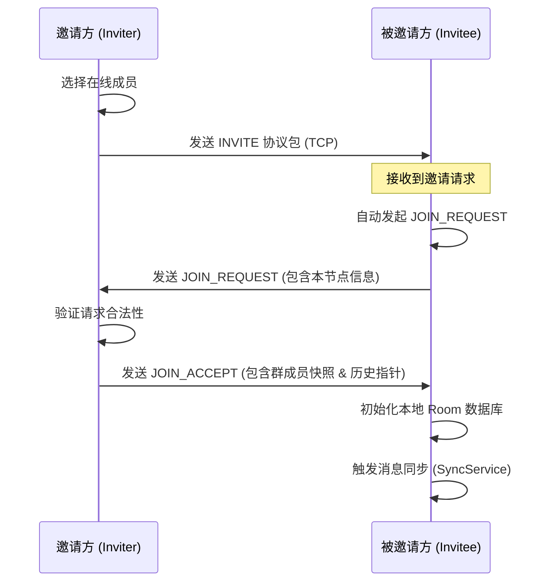
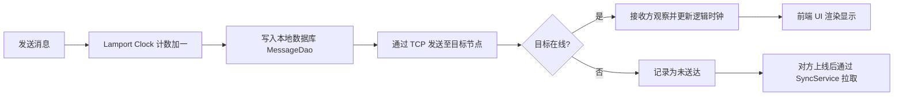

# LAN Chat 项目功能模块详细说明文档

本仓库是一个基于 P2P 架构的局域网即时通讯系统。本文档详细描述了系统的功能模块设计及核心业务流程。

## 1. 功能模块清单

### 1.1 核心服务层 (Java Backend)

| 模块名称 | 主要功能描述 | 关联组件/服务 |
| :--- | :--- | :--- |
| **节点自动发现** | 利用 UDP 广播协议在局域网内宣告本机存在，并动态维护邻居节点列表。 | [DiscoveryService.java](file:///Users/huwenkai/source/InstantMessenger/src/main/java/com/example/lanchat/discovery/DiscoveryService.java), [PeerDirectory.java](file:///Users/huwenkai/source/InstantMessenger/src/main/java/com/example/lanchat/service/PeerDirectory.java) |
| **可靠传输控制** | 基于 TCP 协议实现点对点消息收发，支持连接管理、心跳及重连。 | [TransportService.java](file:///Users/huwenkai/source/InstantMessenger/src/main/java/com/example/lanchat/service/TransportService.java), [TcpServer.java](file:///Users/huwenkai/source/InstantMessenger/src/main/java/com/example/lanchat/transport/TcpServer.java) |
| **逻辑时钟同步** | 使用 Lamport Clock 为每条消息分配时间戳，解决分布式环境下的消息偏序问题。 | [LamportClock.java](file:///Users/huwenkai/source/InstantMessenger/src/main/java/com/example/lanchat/service/LamportClock.java) |
| **群组成员管理** | 处理入群申请、邀请新成员以及维护群组元数据和成员快照。 | [RoomMembershipService.java](file:///Users/huwenkai/source/InstantMessenger/src/main/java/com/example/lanchat/service/RoomMembershipService.java), [RoomDao.java](file:///Users/huwenkai/source/InstantMessenger/src/main/java/com/example/lanchat/store/RoomDao.java) |
| **消息分发与同步** | 实现群消息的扇出分发 (Fan-out) 以及离线期间的增量消息拉取。 | [GroupMessageService.java](file:///Users/huwenkai/source/InstantMessenger/src/main/java/com/example/lanchat/service/GroupMessageService.java), [SyncService.java](file:///Users/huwenkai/source/InstantMessenger/src/main/java/com/example/lanchat/service/SyncService.java) |
| **持久化引擎** | 基于 SQLite 嵌入式数据库，存储身份、联系人、群组及聊天历史。 | [Db.java](file:///Users/huwenkai/source/InstantMessenger/src/main/java/com/example/lanchat/store/Db.java), [Schema.java](file:///Users/huwenkai/source/InstantMessenger/src/main/java/com/example/lanchat/store/Schema.java) |

### 1.2 用户交互层 (Web Frontend)

| 模块名称 | 主要功能描述 | 关联组件/服务 |
| :--- | :--- | :--- |
| **会话 UI** | 提供私聊与群聊的可视化窗口，支持 Markdown 渲染和图片显示。 | [index.html](file:///Users/huwenkai/source/InstantMessenger/src/main/resources/public/index.html), [app.js](file:///Users/huwenkai/source/InstantMessenger/src/main/resources/public/app.js) |
| **设置与配置** | 修改个人昵称、手动添加节点 IP、管理本地数据库配置。 | [app.js](file:///Users/huwenkai/source/InstantMessenger/src/main/resources/public/app.js) |
| **REST API 适配** | 将前端操作转换为后端 API 调用，处理响应状态。 | [ApiRoutes.java](file:///Users/huwenkai/source/InstantMessenger/src/main/java/com/example/lanchat/web/ApiRoutes.java), [Dto.java](file:///Users/huwenkai/source/InstantMessenger/src/main/java/com/example/lanchat/web/Dto.java) |

---

## 2. 核心业务流程图

### 2.1 节点自动发现流程
展示节点如何通过 UDP 广播发现局域网内的其他成员。

### 2.2 邀请成员入群流程
描述发起邀请到成员成功加入群组的完整 P2P 交互过程。

### 2.3 消息发送与一致性同步流程
展示消息如何通过逻辑时钟确保在分布式环境下的顺序一致性。

---

## 3. 文档索引

- [功能模块详细清单](#1-功能模块清单)
- [核心流程图说明](#2-核心业务流程图)
- [代码参考指南](file:///Users/huwenkai/source/InstantMessenger/README.md)
